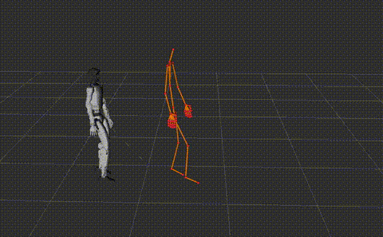

# Motion Player

A ROS 2 package for playing back motion capture data on a humanoid robot (Unitree G1) with simultaneous BVH skeleton visualization in RViz.

## Demo



## Features

- **Motion Playback**: Play pre-recorded motion data (`.pkl` format) on a 29-DOF humanoid robot model
- **BVH Visualization**: Simultaneously display the original BVH motion capture skeleton alongside the robot
- **Loop Control**: Option to loop the motion playback continuously
- **RViz Integration**: Full visualization in RViz2 with robot model and BVH markers

## Prerequisites

- **ROS 2**: Humble (tested)
- Required ROS 2 packages:
  - `robot_state_publisher`
  - `rviz2`
  - `xacro`
  - `tf2_ros`

- Required pip packages:
  - `numpy`
  - `scipy`


## Installation

1. Clone this repository into your ROS 2 workspace:
   ```bash
   cd ~/ros2_ws/src
   git clone <repository_url> motion_player_ros
   ```

2. Build the package:
   ```bash
   cd ~/ros2_ws
   colcon build --packages-select motion_player
   ```

3. Source the workspace:
   ```bash
   source ~/ros2_ws/install/setup.bash
   ```

## Usage

### Basic Usage

Launch the motion player with a motion files:
- To display the BVH skeleton alongside the robot
```bash
ros2 launch motion_player display.launch.py \
    motion_file:=/path/to/your/motion.pkl \
    bvh_file:=/path/to/your/motion.bvh
```

### Launch Arguments

| Argument | Default | Description |
|----------|---------|-------------|
| `motion_file` | (required) | Path to the motion pickle file (`.pkl`) |
| `bvh_file` | (required) | Path to the BVH file (`.bvh`)|
| `loop` | `true` | Whether to loop the motion playback |
| `urdf_file` | (package default) | Path to custom URDF file |
| `rviz_config` | (package default) | Path to custom RViz config file |

## File Formats

### Motion File (`.pkl`)

The motion file contains joint angles that have been **retargeted from motion capture data to the robot URDF**. This file stores the converted motion that can be directly applied to the Unitree G1 robot model.

The pickle file should contain a dictionary with:

```python
{
    'fps': float,           # Frames per second
    'root_pos': np.ndarray, # Root position [n_frames, 3]
    'root_rot': np.ndarray, # Root rotation quaternion (xyzw) [n_frames, 4]
    'dof_pos': np.ndarray,  # Joint positions [n_frames, 29]
}
```

### BVH File (`.bvh`)

The BVH file contains the **original motion capture data** from [MOVIN TRACIN](https://www.movin3d.com) motion capture system.

Standard BVH (Biovision Hierarchy) motion capture format.
The BVH skeleton will be displayed as red spheres (joints) and orange cylinders (bones) in RViz, allowing you to compare the original motion capture with the retargeted robot motion.

## ROS Topics

| Topic | Type | Description |
|-------|------|-------------|
| `/joint_states` | `sensor_msgs/JointState` | Robot joint states |
| `/bvh_markers` | `visualization_msgs/MarkerArray` | BVH skeleton visualization |
| `/tf` | TF2 | Robot transforms |

## Project Structure

```
motion_player_ros/
├── CMakeLists.txt
├── package.xml
├── README.md
├── data/
│   ├── test1.bvh              # Example BVH file
│   └── test1.pkl              # Example motion file
├── doc/
│   └── demo.gif               
├── launch/
│   └── display.launch.py      # Main launch file
├── meshes/                    # Robot mesh files (STL)*
├── rviz/
│   └── urdf.rviz              
├── scripts/
│   ├── bvh_reader.py          # BVH file parser
│   └── motion_player.py       # Main motion player node
└── urdf/
    └── g1_custom_collision_29dof.urdf  # Robot URDF*
```

## Acknowledgments

The URDF and STL mesh files for the Unitree G1 robot are sourced from [Unitree Robotics](https://github.com/unitreerobotics). Please refer to their repositories for the original robot models and licensing information:

- [unitree_ros](https://github.com/unitreerobotics/unitree_ros) - ROS packages with URDF files for Unitree robots
- [unitree_mujoco](https://github.com/unitreerobotics/unitree_mujoco) - Mujoco simulation for Unitree robots

## License

This project is licensed under the MIT License - see the [LICENSE](LICENSE) file for details.

**Note:** The robot URDF and mesh files (`urdf/` and `meshes/` directories) are from Unitree Robotics and may be subject to their own licensing terms.